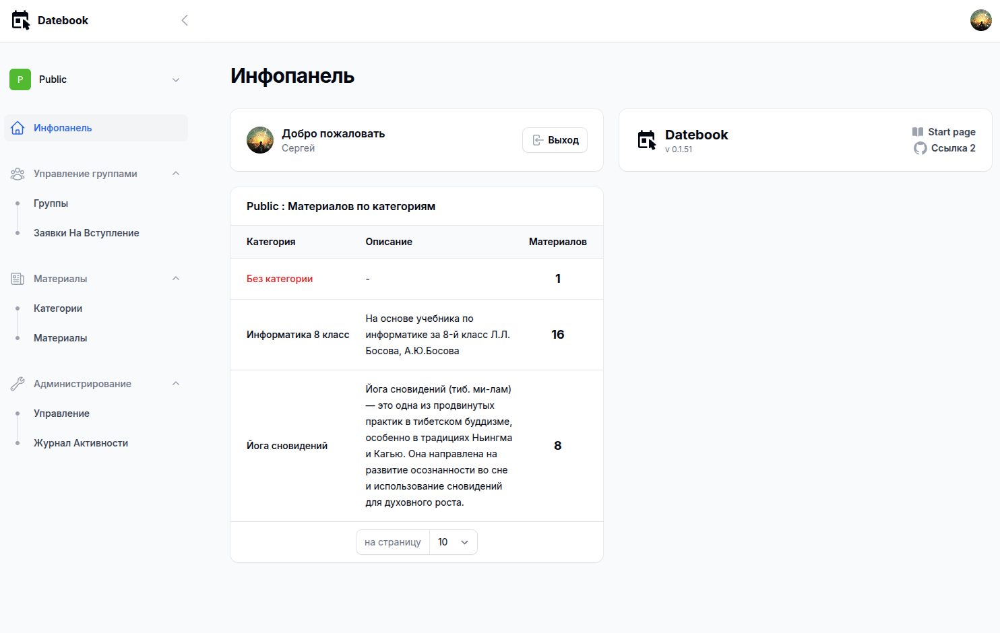

# Datebook v0.1.51
## Система публикации материалов по группам. С управлением ролями и разбиением на команды (группы)



## Развертывание
```
git clone https://github.com/eonvse/datebook1
cd datebook1
```
### Local XAMPP
```
cp .env.example .env 
composer install
node install
```
>Настройте подключение к БД.

### Docker ([Laravel Sail](https://laravel.com/docs/11.x/sail#main-content))
```
sail up
sail shell
```

```
php artisan key:generate
php artisan migrate
php artisan db:seed --class=RolesSeeder
php artisan db:seed --class=TeamsSeeder
php artisan storage:link
```

>Настройте Livewire. (routes/livewire.php. В Sail закомментируйте содержимое файла)
```
git update-index --assume-unchanged routes/livewire.php
```

>Зарегистрируйте пользователя и назначьте ему права Root через mysql для полного управления приложением.
```
INSERT INTO role_user (user_id, role_id) VALUES (CURRENT_USER_ID,1);
```

## License
[MIT license](https://opensource.org/licenses/MIT)

* [Laravel 11](https://laravel.com/docs/11.x)
    * [Laravel Sail (Docker)](https://laravel.com/docs/11.x/sail#main-content)
    * [Laravel Jetstream](https://jetstream.laravel.com/introduction.html)
    * [Livewire Volt](https://livewire.laravel.com/docs/volt)
    * [Filamentphp](https://filamentphp.com)
